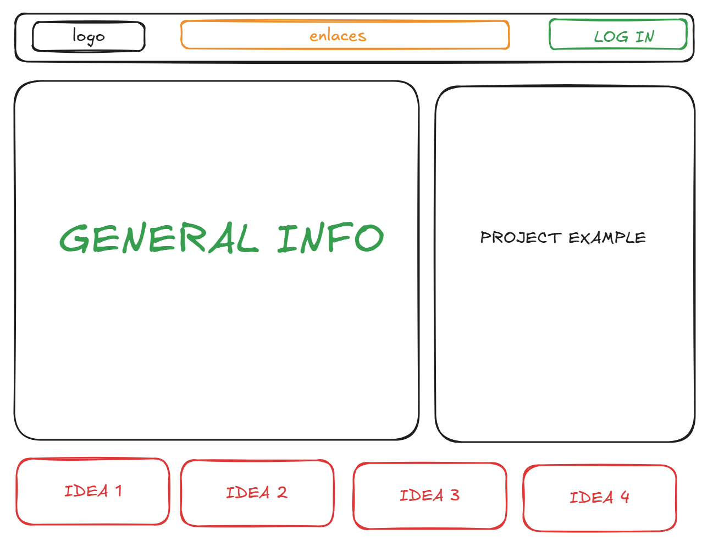

# M1C2 UI/UX Assignment

## Task 1 Referencing this image, create a low-fidelity wireframe.

Low-fidelity wireframe:

## Task 2 Use one of the following websites and the inspect tool to identify 2-3 colors used repeatedly as part of the site’s color scheme. Remember that different shades of gray and black can be included as a color.

- https://timmyomahony.com/ 

font-suisse-intl bg-beige text-black p-0 m-0 selection:text-beige selection:bg-[#242424]

class="text-base 2xl:text-xl flex gap-3 md:gap-4 text-brown"

## Task 3 Create a user story by referencing one of these websites

Como creador de contenido novato en YouTube, quiero poder subir mis primeros videos de mis perros de una forma fácil y rápida. 

Me gustaría tener una guía paso a paso que me ayude a elegir el título adecuado, las etiquetas correctas y una buena miniatura que llame la atención. 

También necesito ver estadísticas básicas como las visualizaciones y los likes para saber si a la gente le está gustando mi contenido. 

Lo más importante es poder interactuar con mis primeros suscriptores a través de los comentarios para ir creando una pequeña comunidad.

Me ayudaría mucho tener sugerencias de otros canales similares al mío para poder inspirarme y aprender de creadores más experimentados. 

Y ya que estoy empezando, necesito que la plataforma me avise si estoy haciendo algo mal, como usar música con derechos de autor o si mi contenido no es apropiado para todos los públicos.

## Task 4  Identify the prime objective of Facebook, Twitter, Google, and Youtube.

YouTube tiene como objetivo principal ser la plataforma universal de videos donde cualquier persona puede convertirse tanto en creador como en espectador. 

Su misión es ofrecer un espacio donde compartir contenido audiovisual sea tan fácil como verlo, eliminando las barreras técnicas y económicas que tradicionalmente limitaban la distribución de video.

La plataforma busca ser un punto de encuentro donde los creadores puedan expresar sus ideas, compartir conocimientos o entretener, mientras construyen una comunidad alrededor de sus contenidos. Al mismo tiempo, ofrece a los espectadores acceso gratuito a una biblioteca casi infinita de videos sobre cualquier tema imaginable.

