# Diagrama de Casos de Uso Twitter

```mermaid
graph TD
    subgraph Twitter-like System
        subgraph Account Management
            Register[Register Account]
            Login[Login]
            ManageProfile[Manage Profile]
            ManagePreferences[Manage Preferences]
            ManageSecurity[Manage Security Settings]
        end
        
        subgraph Core Features
            PostTweet[Post Tweet]
            ViewTweet[View Tweet]
            SearchTweets[Search Tweets]
            Follow[Follow User]
            Unfollow[Unfollow User]
            ViewTimeline[View Timeline]
            ReplyToTweet[Reply to Tweet]
            LikeTweet[Like Tweet]
            Retweet[Retweet]
            UseHashtag[Use Hashtag]
            ViewTrending[View Trending Hashtags]
        end
        
        subgraph Communication
            SendMessage[Send Direct Message]
            ReceiveMessage[Receive Direct Message]
            ViewConversation[View Conversation]
        end
        
        subgraph Optional Features
            AttachImage[Attach Image to Tweet]
            AddLocation[Add Location to Tweet]
            MentionUser[Mention User]
            ScheduleTweet[Schedule Tweet]
            CreateList[Create List]
            CreateBookmark[Create Bookmark]
            ViewAnalytics[View Tweet Analytics]
        end
    end
    
    User((User))
    Follower((Follower))
    
    User --> Register
    User --> Login
    User --> ManageProfile
    User --> ManagePreferences
    User --> ManageSecurity
    User --> PostTweet
    User --> ViewTweet
    User --> SearchTweets
    User --> Follow
    User --> Unfollow
    User --> ViewTimeline
    User --> ReplyToTweet
    User --> LikeTweet
    User --> Retweet
    User --> UseHashtag
    User --> ViewTrending
    User --> SendMessage
    User --> ReceiveMessage
    User --> ViewConversation
    User --> AttachImage
    User --> AddLocation
    User --> MentionUser
    User --> ScheduleTweet
    User --> CreateList
    User --> CreateBookmark
    User --> ViewAnalytics
    
    Follower --> ViewTweet
    Follower --> ReplyToTweet
    Follower --> LikeTweet
    Follower --> Retweet
    Follower --> ViewTimeline
```

## Instrucciones para visualizar en VSC

1. Instala la extensión "Markdown Preview Enhanced" o "Mermaid Preview" en Visual Studio Code
2. Abre este archivo
3. Presiona `Ctrl+K V` (Windows/Linux) o `Cmd+K V` (Mac) para ver la vista previa del diagrama
4. También puedes usar la vista previa nativa de Markdown con `Ctrl+Shift+V` o `Cmd+Shift+V`