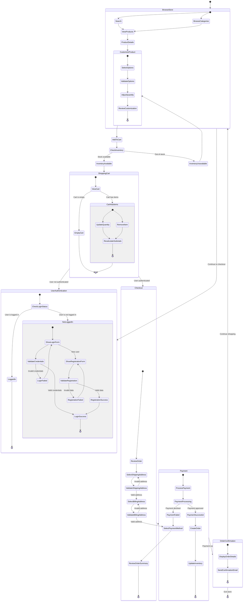

# Coffee eCommerce System Diagrams

## Activity Diagram

```mermaid
stateDiagram-v2
    [*] --> BrowseStore
    
    state BrowseStore {
        [*] --> Search
        [*] --> BrowseCategories
        
        Search --> ViewProducts
        BrowseCategories --> ViewProducts
        
        ViewProducts --> ProductDetails
        ProductDetails --> CustomizeProduct
    }
    
    state CustomizeProduct {
        [*] --> SelectOptions
        SelectOptions --> ValidateOptions
        ValidateOptions --> AdjustQuantity
        AdjustQuantity --> ReviewCustomization
        ReviewCustomization --> [*]
    }
    
    state UserAuthentication {
        [*] --> CheckLoginStatus
        CheckLoginStatus --> LoggedIn: User is logged in
        CheckLoginStatus --> NotLoggedIn: User is not logged in
        
        state NotLoggedIn {
            [*] --> ShowLoginForm
            ShowLoginForm --> ValidateCredentials
            ValidateCredentials --> LoginSuccess: Valid credentials
            ValidateCredentials --> LoginFailed: Invalid credentials
            LoginFailed --> ShowLoginForm
            
            ShowLoginForm --> ShowRegistrationForm: New user
            ShowRegistrationForm --> ValidateRegistration
            ValidateRegistration --> RegistrationSuccess: Valid data
            ValidateRegistration --> RegistrationFailed: Invalid data
            RegistrationFailed --> ShowRegistrationForm
            
            RegistrationSuccess --> LoginSuccess
            LoginSuccess --> [*]
        }
        
        LoggedIn --> [*]
    }
    
    state ShoppingCart {
        [*] --> ViewCart
        ViewCart --> EmptyCart: Cart is empty
        ViewCart --> CartHasItems: Cart has items
        
        state CartHasItems {
            [*] --> UpdateQuantity
            [*] --> RemoveItem
            UpdateQuantity --> RecalculateSubtotals
            RemoveItem --> RecalculateSubtotals
            RecalculateSubtotals --> [*]
        }
        
        EmptyCart --> [*]
        CartHasItems --> [*]
    }
    
    state Checkout {
        [*] --> ReviewOrder
        ReviewOrder --> SelectShippingAddress
        SelectShippingAddress --> ValidateShippingAddress
        ValidateShippingAddress --> SelectBillingAddress: Valid address
        ValidateShippingAddress --> SelectShippingAddress: Invalid address
        
        SelectBillingAddress --> ValidateBillingAddress
        ValidateBillingAddress --> SelectPaymentMethod: Valid address
        ValidateBillingAddress --> SelectBillingAddress: Invalid address
        
        SelectPaymentMethod --> ReviewOrderSummary
        ReviewOrderSummary --> [*]
    }
    
    state Payment {
        [*] --> ProcessPayment
        ProcessPayment --> PaymentProcessing
        
        PaymentProcessing --> PaymentFailed: Payment declined
        PaymentProcessing --> PaymentSuccessful: Payment approved
        
        PaymentFailed --> SelectPaymentMethod
        PaymentSuccessful --> CreateOrder
        CreateOrder --> UpdateInventory
        UpdateInventory --> [*]
    }
    
    state OrderConfirmation {
        [*] --> DisplayOrderDetails
        DisplayOrderDetails --> SendConfirmationEmail
        SendConfirmationEmail --> [*]
    }
    
    CustomizeProduct --> AddToCart
    AddToCart --> CheckInventory
    CheckInventory --> InventoryAvailable: Stock available
    CheckInventory --> InventoryUnavailable: Out of stock
    
    InventoryUnavailable --> CustomizeProduct
    InventoryAvailable --> ShoppingCart
    
    BrowseStore --> UserAuthentication: Continue to checkout
    ShoppingCart --> UserAuthentication: User not authenticated
    ShoppingCart --> Checkout: User authenticated
    
    Checkout --> Payment
    Payment --> OrderConfirmation: Payment successful
    
    OrderConfirmation --> BrowseStore: Continue shopping
    OrderConfirmation --> [*]: Exit store
```
