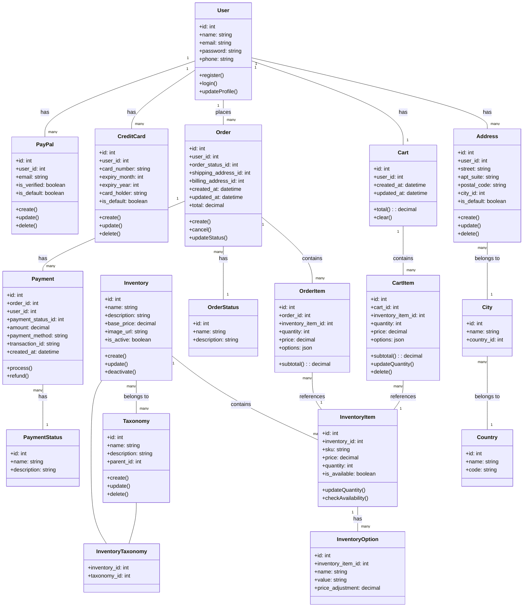

# Coffee eCommerce System Diagrams

## Class Diagram

```mermaid
classDiagram
    %% User related classes
    class User {
        +id: int
        +name: string
        +email: string
        +password: string
        +phone: string
        +register()
        +login()
        +updateProfile()
    }
    
    class Address {
        +id: int
        +user_id: int
        +street: string
        +apt_suite: string
        +postal_code: string
        +city_id: int
        +is_default: boolean
        +create()
        +update()
        +delete()
    }
    
    class City {
        +id: int
        +name: string
        +country_id: int
    }
    
    class Country {
        +id: int
        +name: string
        +code: string
    }
    
    %% Product related classes
    class Inventory {
        +id: int
        +name: string
        +description: string
        +base_price: decimal
        +image_url: string
        +is_active: boolean
        +create()
        +update()
        +deactivate()
    }
    
    class InventoryItem {
        +id: int
        +inventory_id: int
        +sku: string
        +price: decimal
        +quantity: int
        +is_available: boolean
        +updateQuantity()
        +checkAvailability()
    }
    
    class InventoryOption {
        +id: int
        +inventory_item_id: int
        +name: string
        +value: string
        +price_adjustment: decimal
    }
    
    class Taxonomy {
        +id: int
        +name: string
        +description: string
        +parent_id: int
        +create()
        +update()
        +delete()
    }
    
    class InventoryTaxonomy {
        +inventory_id: int
        +taxonomy_id: int
    }
    
    %% Cart and Order classes
    class Cart {
        +id: int
        +user_id: int
        +created_at: datetime
        +updated_at: datetime
        +total(): decimal
        +clear()
    }
    
    class CartItem {
        +id: int
        +cart_id: int
        +inventory_item_id: int
        +quantity: int
        +price: decimal
        +options: json
        +subtotal(): decimal
        +updateQuantity()
        +delete()
    }
    
    class Order {
        +id: int
        +user_id: int
        +order_status_id: int
        +shipping_address_id: int
        +billing_address_id: int
        +created_at: datetime
        +updated_at: datetime
        +total: decimal
        +create()
        +cancel()
        +updateStatus()
    }
    
    class OrderItem {
        +id: int
        +order_id: int
        +inventory_item_id: int
        +quantity: int
        +price: decimal
        +options: json
        +subtotal(): decimal
    }
    
    class OrderStatus {
        +id: int
        +name: string
        +description: string
    }
    
    %% Payment classes
    class Payment {
        +id: int
        +order_id: int
        +user_id: int
        +payment_status_id: int
        +amount: decimal
        +payment_method: string
        +transaction_id: string
        +created_at: datetime
        +process()
        +refund()
    }
    
    class PaymentStatus {
        +id: int
        +name: string
        +description: string
    }
    
    class CreditCard {
        +id: int
        +user_id: int
        +card_number: string
        +expiry_month: int
        +expiry_year: int
        +card_holder: string
        +is_default: boolean
        +create()
        +update()
        +delete()
    }
    
    class PayPal {
        +id: int
        +user_id: int
        +email: string
        +is_verified: boolean
        +is_default: boolean
        +create()
        +update()
        +delete()
    }
    
    %% Relationships
    User "1" -- "many" Address : has
    User "1" -- "1" Cart : has
    User "1" -- "many" Order : places
    User "1" -- "many" CreditCard : has
    User "1" -- "many" PayPal : has
    
    Address "many" -- "1" City : belongs to
    City "many" -- "1" Country : belongs to
    
    Inventory "1" -- "many" InventoryItem : contains
    InventoryItem "1" -- "many" InventoryOption : has
    Inventory "many" -- "many" Taxonomy : belongs to
    Inventory -- InventoryTaxonomy
    Taxonomy -- InventoryTaxonomy
    
    Cart "1" -- "many" CartItem : contains
    CartItem "many" -- "1" InventoryItem : references
    
    Order "1" -- "many" OrderItem : contains
    Order "many" -- "1" OrderStatus : has
    Order "1" -- "many" Payment : has
    OrderItem "many" -- "1" InventoryItem : references
    
    Payment "many" -- "1" PaymentStatus : has
```
